##

# Stream and Batch Processing of Intricate Users App Data

# Introduction
The best way to get a good understanding of any topic is to try it out and build something with it. Following this approach, to understand building a data processing pipeline I build my own. Based on data from an open-source platform such as kaggle and python faker library that together have been modified a little to enable joins.

The objective of the project is,
1. Build and understand a data processing framework used for stream and batch data loading by companies
2. Setup and understand cloud components involved in data streaming and batch processing (API gateway, kinesis, lambda, S3, Redshift)
3. Understand how to spot failure points in an data processing pipeline and how to build systems resistant to failures and errors
4. Understand how to approach or build an data processing pipeline from the ground up

# Contents
- [Project Overview and Goals](#Project-Overview-and-Goals)
- [The Data Set](#the-data-set)
- [Used Tools](#used-tools)
  - [Connect](#connect)
  - [Buffer](#buffer)
  - [Processing](#processing)
  - [Storage](#storage)
  - [Visualization](#visualization)
- [Pipelines](#pipelines)
  - [Stream Processing](#stream-processing)
    - [Storing Data Stream](#storing-data-stream)
    - [Processing Data Stream](#processing-data-stream)
  - [Batch Processing](#batch-processing)
- [Demo](#demo)
- [Conclusion](#conclusion)
- [Follow Me On](#follow-me-on)
- [Appendix](#appendix)

# Project Overview and Goals
For this project, I will assume I work for a user behavior analytics company that for streaming purpose continuously in real-time collecting users app data and for the batch purpose collecting users app data end of the day from different data sources and joins them together to get a broader understanding of the customers. As a comapny, we target both app users and app developers with different services. These services can vary based on custmers and app developers requirement. One of the most valuable service my comapny provide to app users is recommandation app in real time based on the app they downloaded. One the other side, app developers can asked for anlaytics about users app download dehaviour based on their age, location, category of app, and time they spent on each apps. Based on this, I have set some goals around this project.

- Create a data pipeline which can help data scientist to access data fast and accurately to develop their recommendation app charts algorithm for users
- Create a data pipeline that can provide fault-tolerant data to draw analytics based on app developers requirement

# The Data Set / Data Preparation
In this section, I've described how I've created the dataset to use in this project.

The dataset shown here for performing batch and stream processing is produced by two datasets. The app dataset is accessed from kaggle. The link is attached here. https://www.kaggle.com/lava18/google-play-store-apps
The kaggle dataset provides detailed information about the Google Play Store apps. See googleplaystore.csv in my GitHub repository.

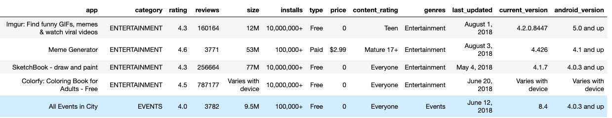

The user details dataset is generated from the faker library of Python. In order to make this dataset more interesting, I've merged a new user details dataset to the Google Play Store app dataset. 

For the batch processing, the user details dataset include details about 200 users. The user details include user_id, user_name, user_location, and the amount of time (in minute) user spent on each app. 
For the stream processing, the user details dataset include details about 1000 users. The user details include user_id, user_name, and user_location.  

The user details are randomly distributed over the Google Play Store app dataset. Below, you can see part of the fake user's details dataset.

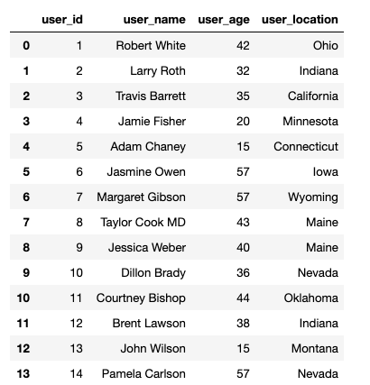

Apart from this, a new column download_date is added to the dataset. 
For the Batch processing, we assume that the different Google Play Store apps have been downloaded by different users between 01-01-2020 and 01-01-2021. 
For stream processing, we assume that the download date is today and data is reaching the API endpoint in real-time.

After merging all the datasets together, the dataset used for stream processing is called "users_app_stream_client_data" and for batch processing called "users_app_batch_client data".

- Why did I choose, and what did I like in this dataset?

As described in the project overview section, as an analytics-based company, we like to explore users behavior and want to make their app experience better. The kaggle dataset provide me detailed information about multiple apps. The apps are precisely distrubted in different app categories, which helps us to compare different apps based on their rating, reviews, installs, and updates.

- What is problematic?

In this dataset most of the app type is free. Basically, most of the app mentioned in this dataset belongs to the free tier type and very few apps are paid type, which makes hard to understand that users buys app or not!!!!

## Data Cleaning and Preprocessing

In real life, data is reaching to the API endpoint or any cloud database might include many nuns, duplicates, or unexpected data types in it. Companies implemented different strategies to tackle this issue. After doing, a thorough check on the Google Play Store apps dataset, I find out the dataset has many Nan, duplicates, and unexpected datatypes in a different column. Below, I will describe how I manage data cleaning and preprocessing steps.

- Data Duplicates

The kaggle google data set include many duplicate entries but once the fake user dataset merged in it, all data rows become unique. Hence, we don't have duplicate data in our final dataset.

- Data Cleaning

By running a simple python code on the user's app data I identify the data include Nun in some rows. 

In the scenario of streaming, we will configure the API endpoint to validate data. If the data include nun rows, the API endpoint will reject the particular row. 

In the scenario of batch processing, we consider, that the data is given to us by clients and saved in the S3 bucket. Here, we will process the data, and make sure first, all the rows which include nun is removed from the the dataset except rating column.

However, the dataset includes an exception for both stream and batch dataset, for the rating column which also includes multiple nun values, I made sure the rating is always filled with some values. To fill these values, I took the median of the rating column and filled the nun values. This task has been performed locally in my machine before finalising the dataset.

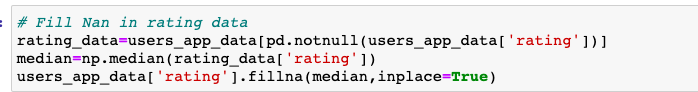

- Data Preprocessing

In the data preprocessing stage, only the data type of each column is identified, but no action has been taken locally.
The datatype will be changed in the processing stage inside the AWS for both stream and batch processing. 

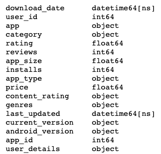

- Save Dataset
At this stage, we make sure the data is ready to go.

In the stream data processing, the data is saved in local machine and will reach to the API endpoint. The name of the dataset is "users_app_stream_client_data".

In the batch data processing, we imagined the data reach inside the S3 bucket everday day at 23:00. The name of the dataset is "users_app_batch_client_data".

### users_app_stream_client_data

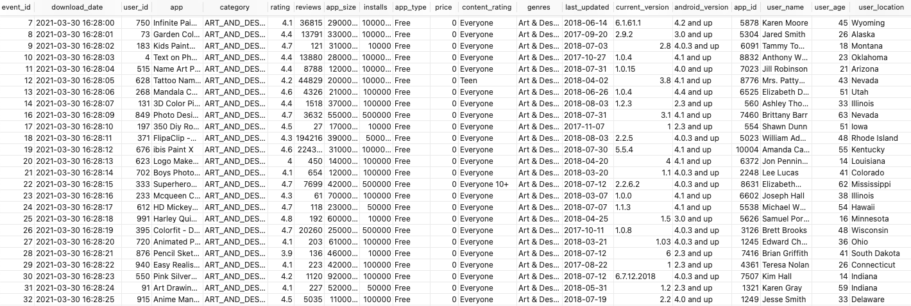

### users_app_batch_client_data

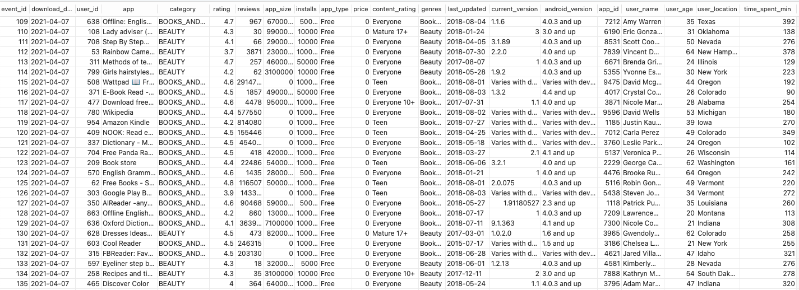

# Used Tools
The data pipeline will build around multiple tools. These tools can be categorized based on their functionality. Below you can see the platform design for streaming processing and batch processing.

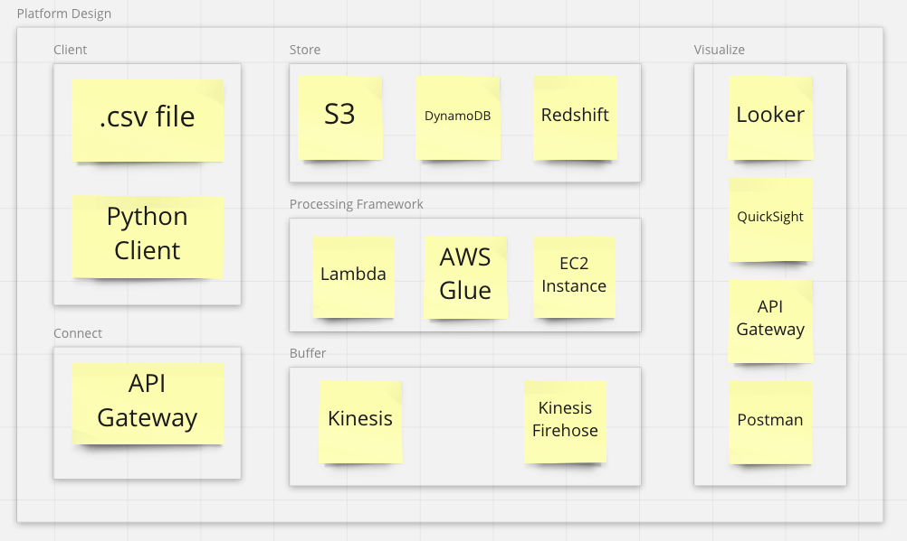

Below each functionality is described with used tools in detail.  

## Client
In this project, the data available for batch and stream processing at the client location is in .csv format. The .csv data will be read by python to post data on the API endpoint.

In the case of stream processing, the python script (see insert_data_to_api.py in the repository) read the data from the users_app_details_stream.csv dataset, convert it to JSON format and POST it to the provided API endpoint.

In the case of batch processing, a client itself will drop the data in the storage. The client can be here a company who is collecting the user's data on an everyday basis.

## Connect
In the scenario of stream processing, a data pipeline will pull data from an API and send data to the buffer. AWS API Gateway POST method is used to pull data from the client. Every time data will reach to the API endpoint, it will trigger the lambda function and send data to AWS Kinesis. 

## Buffer
The two most discussed message queue tools are AWS Kinesis and Kinesis firehose. We will use Kinesis in stream processing to queue the data. The data will lineup in Kinesis every time the API endpoint trigger the lambda function in the AWS. The Kinesis firehose is used to send the data inside the warehouse. 

## Processing
AWS lambda is used to perform stream processing at different stages. The lambda is used to send data from API to Kinesis, Kinesis to S3 bucket, Kinesis to DynamoDB.

In case of batch processing, AWS Lambda is used to perform to processed data initially and AWS Glue is used to perform ETL jobs. Glue take the data from S3 bucket, transform it and, and load it into redshift schema.

## Storage
In the case of stream and batch processing, the service for storing purpose we want to use to hold and store the raw stream data of varying sizes is S3, DynamoDB and Redshift. S3 stands for simple storage service, and it works as a data lake in an AWS environment. S3 will store the data in JSON format. Later the data can be used according to required applications. DynamoDB is a NoSQL database and saving the user's app data in wide column format. AWS redshift is a data warehouse. Redshift allows us to create schema inside its cluster and saved streamed data in a table.

## Visualization
Postman REST API is used to print the data based on input user_id. REST API GET method allows us to call database. Here, we are extracting the data from the DynamoDB.
Apart from it, as a BI tool, Looker is used to performing analytics on data. The Looker is connected to Redshift.

# Pipelines

## Stream Processing
For ease of implementation and testing, we will build the data pipeline in stages. There are 5 stages and these 5 stages shown below.

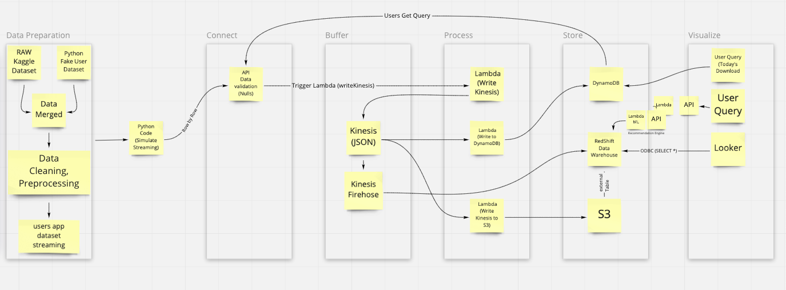

### Connect Data Stream
Every day, the user's real-time data or other requests are reaching to the API endpoint from different sources. Connect data stream is developed by using AWS API Gateway. REST API POST method is configured to collect the users' data and the GET method is configured to send the response based on the user's request. 
The API endpoint is also verifying the data before pushing the data into AWS cloud environment. The verification will only be performed on the data points which include Nun. If this will be the case, API end point reject the data. 

More development can be performed here, but for the sake of simplicity, I only reject the Nun data points.

### Buffer Data Stream
When the data hits the API endpoint, the API endpoint triggers the lambda, and the lambda function pushes the data into the Kinesis stream. The Kinesis stream the data into different AWS services configured in this project. Once the data is ready in kinesis, the following data stream is configured to send the data into different services.

Kinesis - DynamoDB stream: In this data stream, the data is flowing from Kinesis to DynamoDB. Lambda function gets trigger whenever the data is ready inside the kinesis, based on the table partition key and sort key defined in the dynamo DB table and lambda function the data ends up inside the DynamoDB table. 

Kinesis - S3 stream: In this data stream, the data is flowing from Kinesis to the S3 bucket. Once the data ends up in the S3 bucket, it is saved inside the s3 bucket in a JSON format. Later the data can be used for different purposes. Again lambda is used here, for the processing of data before saving it inside the S3 bucket.

Kinesis- Kinesis firehose - Redshift stream: This stream pipeline is used to send the data from Kinesis to the Redshift data warehouse. To send the data to Redshift in AWS, a Kinesis firehose is used to send the data into redshift. 

### Processing Data Stream
the data type of the different column is changed based on the type of data column persist. For example, the column "last_updated" type is changed to DateTime and the date order is changed to year-month-date.

### Storing Data Stream

### Visualizing Data Stream

## Batch Processing
For ease of implementation and testing, the batch processing pipeline is built in 3 stages and these 3 stages shown below.

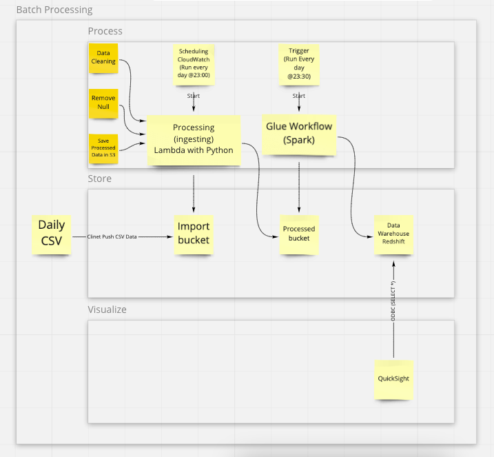

### Store 
We assume here the client is putting the everyday data inside the S3 bucket, the bucket name is users-app-batch-client-data. The data is described in the "Dataset" section and called "users_app_batch_client_data". The data is available in .csv format. The location where the client data is saved inside the S3 bucket is users-app-batch-client-data/incoming_client_data. Once the data is here, initial processing is performed by AWS Lambda everyday at 23:00 PM.

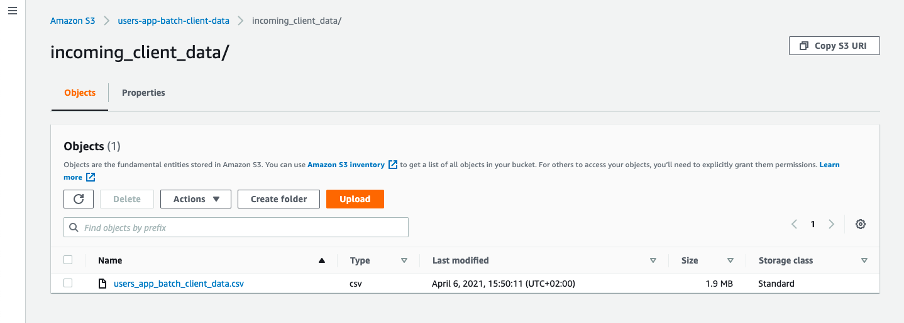

The s3 bucket users-app-batch-client-data includes another folder processed_client_data and the folder contains the processed data coming after processing performed by AWS Lambda. 

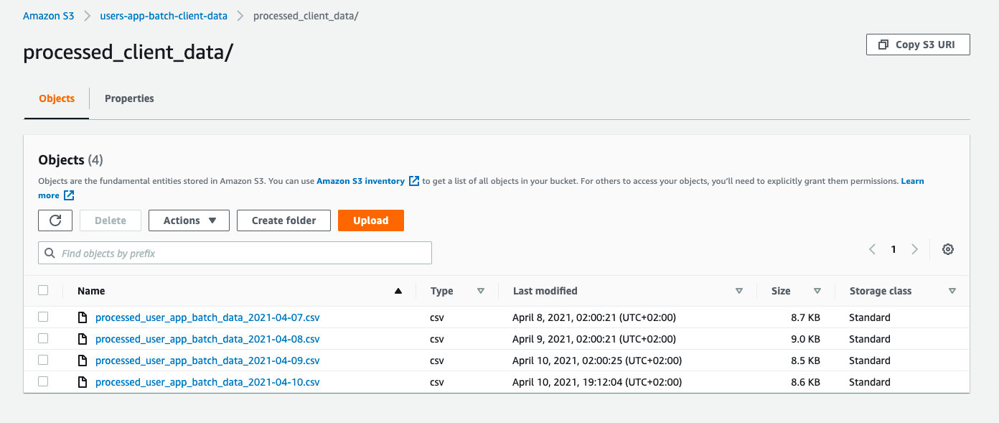

The redshift data warehouse is used to save all the processed data coming from the ETL processing stage. Once the data is processed by AWS Glue job every day, the data is saved inside the Redshift warehouse, so we can use the data for visualization purposes.

### Processing 
The processing is performed in two stages. One by AWS Lambda and the second by Glue Job. 

In the first processing stage i.e. by Lambda, it takes data from users-app-batch-client-data/incoming_client_data and drops the rows which include nuns. It changes the date format to %Y-%m-%d format. And finally, it removes the expected characters from the column, for example removing of $ sign from the "price" column.

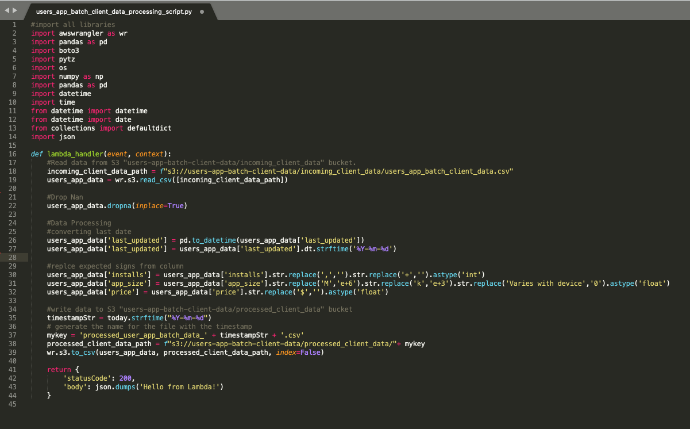 

In the second stage of processing, ETL Job is performed by AWS Glue. In this stage, Glue mapped the correct data type to redshift, defined in the table inside redshift. The Glue job runs every day at 23:30, it Extracts data from the S3 bucket "users-app-batch-client-data/processed_client_data", Transform the data into correct data type amd Load data inside the  redshift warehouse.

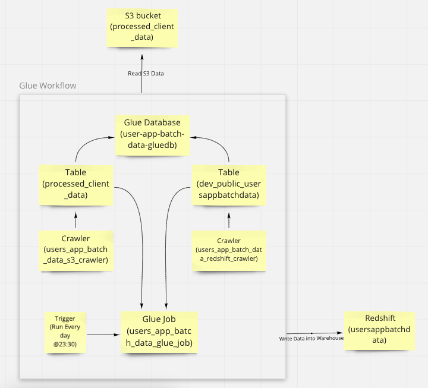 

### Visualization
In the visualization stage, AWS QuickSight is connected to the Redshift warehouse, and it visualizes the data based on ETL data coming from the processing stage.

# Demo
---

# Conclusion
---

# Follow Me On
https://www.linkedin.com/in/ketan-sahu/

# Appendix

[Markdown Cheat Sheet](https://github.com/adam-p/markdown-here/wiki/Markdown-Cheatsheet)
